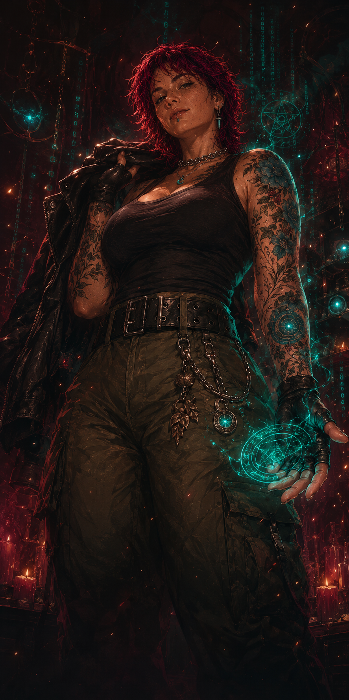

# Karina «Kai» Lark

`AI / LLM Engineer` · `PromptOps → LLM eng` · `tarot → code` · `ADC main`

<table>
<tr>
<td valign="top">

🤖 I build LLM systems and ship them to production  
🧠 Support → monitoring & QA → PromptOps → LLM engineering — same brain, fewer translators  
🔮 I read tarot too, and shipped it as code (Arcana, pinned below)  
🌍 Open to relocation: Europe (PL / CZ / RS pref.)  
🎧 Fueled by post-punk & caffeine  

> I pull structure out of chaos — logs, prompts, and the occasional tarot spread.

🧬 **ADC main** — 50% uptime, 100% crit damage  
🎯 Learned to kite from burnout, not bots  
⚠️ May require peel (or just space and Monster Energy)  

> sudo apt install dopamine  
> if (coffee === true && monster === true) { focus++; }

💬 *Champion Quotes:*  
> "I don't scale. I snowball."  
> "It's not chaos — it's undocumented structure."  
> "The logs and the cards say the same thing once you can read them."  
> "One cat runs my cluster, one reviews my PRs, the third force-pushes to main."  
> "My ELO is higher than your uptime."  
> "I don't wait for permission to carry."

</td>
<td width="300" valign="top">

</td>
</tr>
</table>

---

### 🧠 Stack

        

🤖 **LLM:** Claude (Haiku + Sonnet, model-routed) · OpenRouter · OpenAI Whisper · Vision  
🔎 **RAG:** Qdrant · embeddings · reranking · retrieval eval  
🧪 **Evals & cost:** behavioral evals · prompt-regression tests · cost-aware routing · prompt caching  
📊 **Monitoring:** Grafana · Graylog · Langfuse  
🗄️ **Infra:** aiogram · SQL / SQLite · Notion API · REST / webhooks · Git / bash / ssh  

*Also: scoping, specs, delivery and the commercial paperwork when a project needs it — but the build is the point.*

🌍 **Languages:** 🇷🇺 Native Russian · 🇬🇧 English (C1) 

---

🚀 **Current queue:** AI / LLM Engineer (applied — building LLM systems on APIs)  
🎯 **Looking for ranked team:** remote or relocation — Europe (PL / CZ / RS pref.)  
📫 **Add me:**   

🕹️ Easter Egg: <i>Champion Spotlight — Kai, the Neurodivergent Engineer</i>

 

**Role:** ADC / Mage Hybrid  
**Resource:** Focus (instead of Mana)  
**Damage Type:** Physical / Magic  
**Scaling:** Knowledge + Concentration + Intuition  
**Origin:** Tech Support Depths  
**Patch:** Pre-PromptOps · *re-rolled into LLM Engineer (current patch)*

---

### 🧬 Passive — *Overfocus*

Kai accumulates Focus while listening to russian post-punk playlists and deep-diving into broken pipelines, model outputs that won't validate, or half-written specs.
Focus builds faster when the task is obscure, undocumented, or shipping under pressure.
Once Focus reaches 100%, her next ability is Overloaded — granting enhanced insight or throughput.

*⚠️ Staying in Overfocus mode too long triggers Mental Overload — abilities weaken and Kai gets distracted, muttering about token budgets.*

To reset Overload, Kai must briefly switch context (short offline break, look out the window, touch grass, or reheat coffee).
This clears the stack and restores baseline clarity.

**Bonus:**
If Kai opens a can of Monster Energy™ during work — Focus gain is doubled for 10 minutes.

---

### 💡 Q — *Pattern Lock*

Kai highlights invisible structure in chaos: where a RAG pipeline drops context, where a prompt leaks format, which model a call should route to.  
Perfect for tracing why the bot answered wrong and pinning the fix.

**Bonus:**
Holding Monster increases speed of activation.

*• Enhanced: auto-routes cheap calls to Haiku and writes the regression test that keeps them there.*

---

### 🧪 W — *Eval Storm*

Runs behavioral evals and prompt-regression suites against the model. Each cast surfaces where the output drifted and forms a fix hypothesis fast.

*• Stackable. At 3 charges, enters "Flow State" — reducing cooldowns and widening insight radius.*  
*• Each consecutive cast increases chance of Overload buildup.*

---

### 🧠 E — *Prompt Mirage*
A long-cooldown ability. Not spammable.
Effective only at moderate Focus with no context-switch in the last 3 minutes.

Summons a well-structured prompt — plus the routing and caching around it — tuned to bend even the most stubborn LLMs.  
Allies call it wizardry.

*• Can backfire beautifully if the model isn't aligned.*  
*• Enhanced: cuts token cost while keeping accuracy.*  
*• Overloaded version: generates two alternative prompt strategies, at risk of overthinking.*

---

### 🚀 R — *Ship to Prod*  (Ultimate — unlocks at 6 / 11 / 16)

Kai collapses ambiguity into a shipped system: spec → pipeline → production.  
The bot goes live, the tests stay green, the cost curve drops.

At:
- **Level 6**: prototypes a working pipeline from a vague idea.
- **Level 11**: hardens it — retry/backoff, eval harness, cost guards.
- **Level 16**: ships to prod and it survives the weekend.

*• Passive bonus: musical damage over time (if headphones are on). Press ctrl5 to put headphones on.*

---

